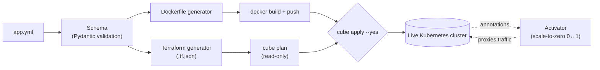

# cube-manifest

One declarative `app.yml` per app → a generated Dockerfile, Terraform, and
a real deploy to your own Kubernetes cluster. No Helm chart to hand-write,
no separate CI workflow to maintain by hand, no bespoke build script.

```yaml
# apps/hello/app.yml
name: hello
enabled: true
app_type: service
port: 8080

docker_config:
  language: python
  entry_point: ["python", "app.py"]

scaling:
  min_replicas: 0          # scale to zero when idle
  idle_timeout_seconds: 300
  activation:
    type: http
```

```bash
cube generate dockerfile hello   # see the Dockerfile it would build
cube generate terraform hello    # see the .tf.json it would apply
cube build hello                 # real docker build + push to your registry
cube plan hello                  # real `terraform plan` against your cluster, read-only
cube apply hello --yes           # actually apply it
cube ship hello --yes            # build + apply + rollout-restart, all in one - the common case
                                  # for shipping a real code change to an already-deployed app
```

## Why this exists

Kubernetes has plenty of tools for pieces of this (Helm templates
manifests, Terraform manages infrastructure, GitHub Actions builds
images) but wiring them together for a small self-hosted cluster still
means hand-maintaining a Dockerfile, a Terraform module, a CI workflow,
and your own scale-to-zero story separately, per app. cube-manifest is
the opposite bet: one file describes the app, and everything else is
generated from it - closer to Railway/Fly.io's "one config, one deploy"
model, but for a cluster you actually own and can inspect every
generated artifact of.

This isn't a general-purpose Kubernetes templating tool (that's Helm's
job) or a multi-cloud IaC platform (that's Terraform/Pulumi's job) - it's
opinionated on purpose. If you outgrow the opinion, the generated
Dockerfile/Terraform are plain, inspectable text you own outright, not
hidden behind a DSL.



## What's real right now

- A single, fully validated `app.yml` schema (Pydantic) - one canonical
  shape for health checks, security context, storage, RBAC, scheduling,
  scale-to-zero activation, everything. No silent typos: unknown fields
  fail loudly at `cube validate` instead of being ignored.
- A Terraform generator that builds plain Python dicts and serializes them
  as `.tf.json` - not hand-assembled HCL strings. There's no string-
  templating step for a value to escape out of, which is the actual point:
  a value containing `"`, `${...}`, or literal HCL syntax is just an inert
  string leaf, never new structure.
- A Dockerfile generator that's mandatory two-stage for every language
  (python/rust/node/go/java, plus passthrough if you bring your own
  Dockerfile) and uses BuildKit secret mounts for anything like a private
  git deploy key - it never ends up baked into a layer, builder or final.
- Real `cube apply`: checks what already exists live via `kubectl get`,
  imports it into a throwaway local Terraform state first (import only
  adds state tracking, it can't mutate or delete anything), *then* plans
  and applies - so re-running this against an app someone else's tool
  already deployed doesn't blow up with "already exists," and never
  guesses a resource's kind from its name like naive approaches do.
  `apply` always shows a real plan first; nothing happens without `--yes`.

  ```mermaid
  sequenceDiagram
      participant You
      participant cube as cube apply
      participant kubectl as kubectl (read-only)
      participant terraform
      participant Cluster as Live cluster

      You->>cube: cube apply myapp --yes
      cube->>cube: generate .tf.json
      loop for each resource
          cube->>kubectl: get <kind> <name>
          kubectl->>Cluster: read-only check
          alt already exists
              cube->>terraform: import (state only, no mutation)
          else doesn't exist
              Note over cube: leave un-imported - real create
          end
      end
      cube->>terraform: plan -out=tfplan
      terraform-->>You: show the real diff
      cube->>terraform: apply tfplan
      terraform->>Cluster: apply for real
  ```
- Scale-to-zero integration: emits the annotation contract a separate
  always-on "activator" process reads to do real 0↔1 scaling - covered by
  a contract test that round-trips through that process's actual parser,
  not just a hand-maintained assumption of what it expects.
- A Fernet decrypt bridge for secrets already encrypted with the
  `ENC[...]` scheme some clusters use - decryption happens once, at load
  time; nothing downstream needs to know the format exists, and nothing is
  ever written to disk in plaintext.
- Node image prewarming after `cube build`: `build_and_push` only ever
  talks to the registry via plain `docker push` - no node's kubelet ever
  pulls the image until some Deployment actually needs it. For a
  `min_replicas: 0` app that first pull gets deferred all the way to the
  next real cold start, which then pays full network-pull latency as part
  of what's supposed to be a fast scale-up. Confirmed for real on this
  project's own cluster: a 55MB image's first-ever pull took 94s
  immediately after a build, even though a raw registry blob fetch on the
  same link measured over 1GB/s moments later - the image was simply never
  resident on any node yet, not a slow registry. `cube build` now forces
  every Ready, schedulable node to pull the freshly pushed image right
  away (a disposable per-node Pod, `imagePullPolicy: Always`, deleted once
  the pull completes) - the same 55MB image's *next* cold start pulled in
  61ms instead of 94s. `--no-prewarm` skips this if you'd rather defer the
  pull yourself.

All of the above has been run for real, not just tested in isolation -
see [Battle-tested](#battle-tested) below.

## What's not built yet

- A plugin system for anything beyond the built-in language/resource
  support (no third-party hooks yet).
- A real secrets backend (sops/age) - the Fernet bridge is a compatibility
  shim for an existing format, not the intended long-term design.
- Storage class / ingress class cluster-wide defaults in the cluster-config
  file - only `registry_url` lives there so far (see `cube build`/`cube
  generate terraform` below); those two are still read from each app's own
  `app.yml`.
- `external_repo` build caching - `cube build` shallow-clones fresh every
  time rather than keeping a persistent mirror per repo URL.

## Cluster config

Registry URL (and, later, other cluster-specific defaults) live in an
optional `.cube-manifest.yaml`, discovered by walking up from `--apps-dir`'s
parent directory the same way `.git`/`.eslintrc` get found:

```yaml
registry_url: "my-registry.example:5000"
```

`CUBE_MANIFEST_REGISTRY_URL` overrides whatever the file says. With neither
a file nor the env var, `registry_url` defaults to `localhost:5000` - a
generic default, not any one deployment's real value.

## `app.yml` field reference

The `hello` example above only shows the minimum needed to ship something.
Everything below is real, schema-validated, and used by apps already
running on this cluster — but wasn't written down anywhere outside
`schema/models.py`'s own inline comments until now. If you're reading this
because you had to go source-diving to find one of these, that's the exact
gap this section exists to close.

**Ingress** (LAN/internal HTTPS, via whatever ingress controller your
cluster runs):

```yaml
ingress:
  enabled: true
  host: myapp.internal
  service_port: 3000        # defaults to 80 if omitted
```

**NodePort** — exposes the app on a fixed port on every cluster node, not
just internally. This is also the piece `vps_route` (below) forwards
public traffic *to*, so anything you want reachable from the public VPS
route needs this too:

```yaml
service_type: NodePort
port: 8081
node_port: 30081             # pick an unused one - `cube list` / grep existing
                              # apps/*/app.yml for `node_port:` to see what's taken
```

**VPS public routing** — registers a real, live path on the public VPS's
Caddy instance (`cybertechnology.sh`), automatically, on `cube
build`/`apply`. No manual Caddyfile editing:

```yaml
vps_route:
  path_prefix: /myapp        # must match ^/[a-zA-Z0-9/_-]*$
  host: cybertechnology.sh   # optional - this is already the default
```

Requires `node_port`/`service_type: NodePort` above (the route resolves as
public request → VPS Caddy → the VPS's Tailscale link to this cluster's
host → that NodePort → your Service). It ALSO requires one-time setup this
schema field alone gives you no hint even exists: either
`CUBE_MANIFEST_VPS_SSH_HOST`/`_SSH_USER`/`_SSH_PASSWORD` (or
`_SSH_IDENTITY_FILE`) environment variables, or a
`~/.config/cube-manifest/vps-routing.yaml` file with the same keys
lowercased (`ssh_host`, `ssh_user`, `ssh_password`/`ssh_identity_file`,
optionally `ssh_port`, `caddy_container`, `default_host`,
`home_tailscale_ip`). Without either, `vps_route` is silently skipped with
a one-line warning at `build`/`apply` time — it's opt-in infrastructure,
not something every environment needs. See `vps_routing.py`'s own module
docstring for the full security reasoning (why this SSHes into the VPS and
talks to Caddy's admin API rather than templating a Caddyfile by hand).

**Secrets** — values already encrypted with this project's `ENC[...]`
Fernet scheme, decrypted once at load time straight into a real Kubernetes
Secret (never written to disk in plaintext):

```yaml
secrets:
  POSTGRES_HOST: "ENC[gAAAAABq...]"
```

A legacy `secrets: [{name: ..., value: ...}]` list shape is still accepted
and silently normalized into the dict shape above (with a deprecation
warning) — new apps should use the dict shape directly.

**External repo** — build from a separate git repo instead of a local
`docker_config.context`:

```yaml
external_repo:
  url: "https://github.com/you/your-repo.git"
  branch: main
  path: subdir-if-the-app-isnt-at-repo-root   # optional
  ssh_key_secret: my-deploy-key-secret        # optional, for a private repo
```

`cube build` shallow-clones fresh on every build (no persistent mirror
yet — see [What's not built yet](#whats-not-built-yet)).

**Storage** — a PVC, hostPath, or emptyDir volume (exactly one backing per
entry):

```yaml
storage:
  - name: myapp-data
    size: 1Gi
    mount_path: /var/lib/myapp
    get_or_create: true       # reuse an existing PVC with this name instead of erroring if it's already there
    pvc_name: myapp-data-pvc
```

**Health checks** — the real canonical shape is **singular** `health_check`
with full `_seconds`-suffixed field names — this is the one field
`AppConfig` actually defines (`models.py`'s `HealthCheck`/`Probe`); nothing
else survives past `compat.py` unchanged:

```yaml
health_check:
  liveness:
    command: ["wget", "--no-verbose", "--tries=1", "--spider", "http://127.0.0.1:8080/"]
    initial_delay_seconds: 5
    period_seconds: 30
    timeout_seconds: 5
    failure_threshold: 3
  readiness:
    command: ["wget", "--no-verbose", "--tries=1", "--spider", "http://127.0.0.1:8080/"]
    initial_delay_seconds: 5
    period_seconds: 10
    timeout_seconds: 5
    failure_threshold: 3
```

Several already-deployed apps use shapes `schema/compat.py` accepts as
**legacy** and silently rewrites into the shape above, each with a
`DeprecationWarning` at load time:

- **plural** `health_checks:` (short field names — `initial_delay`/
  `period`, no `_seconds`, seen in e.g. `portfolio/app.yml`). Real,
  currently-live gap worth knowing if you use this shape:
  `compat.py::normalize_health_check` only actually carries over
  `initial_delay`/`period` from your input — `timeout_seconds` and
  `failure_threshold` are silently **hardcoded** to `5`/`3` regardless of
  what you wrote, for both liveness and readiness. If you need a
  different timeout or failure threshold, use the canonical singular
  shape above directly; the plural shape can't express it.
- `health_check.{readiness,liveness}_probe.exec.command` (seen in some
  older apps).
- `docker_config.health_check` (a Docker-native `HEALTHCHECK`-instruction
  shape used by a handful of apps — `activator`, `jobber`, `paipai`,
  `paipai-ui`, `paper-trader`, `pod-rebalancer`, `service-discovery` — note
  this one entirely SUPERSEDES a co-present `health_checks`/`health_check`
  block rather than merging with it, matching the old
  `terraform_generator.py` behavior this preserves).

New apps should use the canonical singular `health_check` shape directly
rather than relying on any of the three normalizations above.

**Also real, schema-validated, but not covered here in depth** —
`resources` (CPU/memory requests+limits), `rbac`, `scheduling`
(node/pod affinity, tolerations, anti-affinity), `init_containers`,
`security_context`, `deployment_strategy` (rolling update
surge/unavailable). Check `schema/models.py`'s own field-level comments
for these — they're accurate and current, just not duplicated into prose
here yet.

**Fields that look real but do nothing** — per `schema/models.py`'s own
top-of-file docstring, these validate but are never read by any
generator: `app_name`, `cleanup.*`, `container`,
`container_security_context`, `expose_service`, `monitoring`, `version`,
and the top-level `image_pull_policy`/`image_pull_timeout`. If you're
about to set one of these expecting it to change generated behavior, it
won't — check `models.py`'s docstring for the current, authoritative list
before relying on any field this README doesn't otherwise mention.

## Install

```bash
git clone https://github.com/Silenttttttt/cube-manifest
cd cube-manifest
uv sync --extra dev   # or: pip install -e ".[dev]"
```

Requires `terraform` and `kubectl` on `PATH`, and a working kubeconfig.

## CLI

```
cube list                          # every app under ./apps, type + enabled state
cube validate [app...]             # schema-check one, several, or all apps
cube generate dockerfile <app>     # print (or --out FILE) the generated Dockerfile
cube generate terraform <app>      # print (or --out FILE) the generated .tf.json
cube build <app> [--no-push] [--no-prewarm] [--build-secret id=path ...]
                                    # real docker build, tag as :latest, roll the old :latest
                                    # to :previous first, then push (unless --no-push) and prewarm
                                    # every node's image cache (unless --no-prewarm).
                                    # --build-secret is repeatable, forwarded verbatim as
                                    # `docker build --secret id=<id>,src=<path>` - use it for anything
                                    # a Dockerfile's `RUN --mount=type=secret,id=<id>` needs at build
                                    # time (a private git+https token, for example) without it ever
                                    # landing in an image layer. See the callout below this table
                                    # before relying on it for a private dependency.
cube plan <app>                    # real terraform plan against your cluster - read-only
cube apply <app> [--yes]           # apply it for real - requires --yes to actually touch anything
cube ship <app> [--yes] [--no-restart] [--no-push] [--no-prewarm]
                                    # build + apply + rollout-restart, composed into one command -
                                    # the common case of actually shipping a real code change to an
                                    # already-deployed app (reapplying an unchanged :latest tag never
                                    # forces already-running pods to repull it, so a bare `apply` on
                                    # its own isn't enough after a code change). build/plan/apply stay
                                    # separate, independently-useful primitives - `ship` doesn't
                                    # replace them, it's just those three run back-to-back. Same --yes
                                    # gate as `apply`: without it, still builds+pushes for real (like
                                    # `build` always does) and shows the plan, but never applies or
                                    # restarts. --no-restart for a config-only change with no new image.
```

All commands take `--apps-dir` to point at wherever your `apps/<name>/app.yml`
files live.

**A build can report success while installing nothing, if it depends on a
private `git+https` package.** Found for real: an app's Dockerfile does
`pip install git+https://github.com/org/private-repo.git@<ref>` using a
`RUN --mount=type=secret,id=gh_pat` to authenticate, built via `cube build
<app> --build-secret gh_pat=/path/to/token`. Two independent failure modes
compound here, and either one alone can hide the other for a long time:

1. **Unpinned `git+https` URL → the pip-install layer never invalidates.**
   Docker's build cache is keyed on instruction/file text, not what the
   remote actually contains right now - `git+https://.../repo.git` (no
   `@sha`) is the same text today and after the remote changes, so a cached
   layer just gets reused forever and your real fix silently never ships,
   no error, no warning.
2. **Missing `--build-secret` → the clone fails, but only once the layer
   above actually has to run again.** If a build has been living entirely
   off the cached layer from failure mode 1, the credential can be broken
   (an expired/deleted token, a build invoked without the flag) with zero
   symptoms until something else finally forces that layer to rebuild -
   at which point it fails loudly (`fatal: could not read Username for
   'https://github.com'`), at exactly the moment you're least expecting a
   credential problem, not a code problem.

The rule, and it's both halves or neither protects you: **pin every
private `git+https` dependency to a commit SHA, and always pass
`--build-secret` for whatever that Dockerfile needs.** Pinning without the
secret just turns "silently stale" into "loudly broken" sooner (still an
improvement, but not the fix); the secret without pinning still leaves you
unable to tell "my fix shipped" from "the cache ate it" on every build
that doesn't happen to invalidate that layer for an unrelated reason.

`cube build`/`cube ship` now catch both halves automatically and print a
`Warning:` line for either one (`_private_git_dependency_warnings` in
`build.py`, scanning the resolved source's `requirements.txt` for a `git+`
line) - never a hard failure, just noisy on the very first build instead
of silent for weeks. Deliberately narrow: only `requirements.txt`, only
`git+` lines - it's there to catch this one real, already-seen failure
mode early, not to be a general dependency linter.

**A repo that clones fine from your own shell is not proof it's public.**
A credential helper configured on your host (an `hg api`/`gh`-authenticated
session, a cached `git credential` entry) can make a private repo clone
successfully for you while the exact same URL fails inside a `docker
build`, which runs with none of that — confirmed for real: a repo that
cloned fine standalone turned out to be private (`gh api repos/<org>/<repo>
--jq '{private,visibility}'` is the real check), and would have needed
`--build-secret` all along. Don't infer a repository's visibility from
whether your own terminal can reach it.

## Battle-tested

This isn't a toy - it replaced the deploy pipeline for a real homelab
Kubernetes cluster's actual running services. Every one of the following
was verified against the live cluster, not just asserted by a test suite:

- A real `terraform plan`/`apply` cycle against a live cluster, including
  importing pre-existing resources so the diff is the real diff, not
  false "will create" noise.
- A real cold-start through a scale-to-zero activator, end to end, for
  multiple apps.
- A real message published through a message broker using credentials
  decrypted by the Fernet bridge - proving the decrypted value matched
  the live broker's actual configured credentials exactly.
- A real `psql` query against a database after cutover, confirming every
  database was still there.
- A zero-downtime rolling update of the activator process itself (2
  replicas, watched pod-by-pod through the whole rollout), followed by
  forcing a different app back to zero replicas and confirming a fresh
  cold-start still worked - proving the tool didn't break the very thing
  it depends on to test itself.
- Three real bugs were caught by this process *before* they could cause
  damage: a missing namespace label that would have been silently
  stripped, an Ingress TLS default that would have dropped a real
  certificate, and a resource-type mapping typo that would have made
  Terraform try to create a DaemonSet that already existed.

## License

MIT — see [LICENSE](LICENSE).
