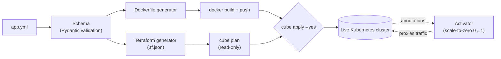

# cube-manifest

One declarative `app.yml` per app → a generated Dockerfile, Terraform, and
a real deploy to your own Kubernetes cluster. No Helm chart to hand-write,
no separate CI workflow to maintain by hand, no bespoke build script.

```yaml
# apps/hello/app.yml
name: hello
enabled: true
app_type: service
port: 8080

docker_config:
  language: python
  entry_point: ["python", "app.py"]

scaling:
  min_replicas: 0          # scale to zero when idle
  idle_timeout_seconds: 300
  activation:
    type: http
```

```bash
cube generate dockerfile hello   # see the Dockerfile it would build
cube generate terraform hello    # see the .tf.json it would apply
cube plan hello                  # real `terraform plan` against your cluster, read-only
cube apply hello --yes           # actually build/apply it
```

## Why this exists

Kubernetes has plenty of tools for pieces of this (Helm templates
manifests, Terraform manages infrastructure, GitHub Actions builds
images) but wiring them together for a small self-hosted cluster still
means hand-maintaining a Dockerfile, a Terraform module, a CI workflow,
and your own scale-to-zero story separately, per app. cube-manifest is
the opposite bet: one file describes the app, and everything else is
generated from it - closer to Railway/Fly.io's "one config, one deploy"
model, but for a cluster you actually own and can inspect every
generated artifact of.

This isn't a general-purpose Kubernetes templating tool (that's Helm's
job) or a multi-cloud IaC platform (that's Terraform/Pulumi's job) - it's
opinionated on purpose. If you outgrow the opinion, the generated
Dockerfile/Terraform are plain, inspectable text you own outright, not
hidden behind a DSL.



## What's real right now

- A single, fully validated `app.yml` schema (Pydantic) - one canonical
  shape for health checks, security context, storage, RBAC, scheduling,
  scale-to-zero activation, everything. No silent typos: unknown fields
  fail loudly at `cube validate` instead of being ignored.
- A Terraform generator that builds plain Python dicts and serializes them
  as `.tf.json` - not hand-assembled HCL strings. There's no string-
  templating step for a value to escape out of, which is the actual point:
  a value containing `"`, `${...}`, or literal HCL syntax is just an inert
  string leaf, never new structure.
- A Dockerfile generator that's mandatory two-stage for every language
  (python/rust/node/go/java, plus passthrough if you bring your own
  Dockerfile) and uses BuildKit secret mounts for anything like a private
  git deploy key - it never ends up baked into a layer, builder or final.
- Real `cube apply`: checks what already exists live via `kubectl get`,
  imports it into a throwaway local Terraform state first (import only
  adds state tracking, it can't mutate or delete anything), *then* plans
  and applies - so re-running this against an app someone else's tool
  already deployed doesn't blow up with "already exists," and never
  guesses a resource's kind from its name like naive approaches do.
  `apply` always shows a real plan first; nothing happens without `--yes`.

  ```mermaid
  sequenceDiagram
      participant You
      participant cube as cube apply
      participant kubectl as kubectl (read-only)
      participant terraform
      participant Cluster as Live cluster

      You->>cube: cube apply myapp --yes
      cube->>cube: generate .tf.json
      loop for each resource
          cube->>kubectl: get <kind> <name>
          kubectl->>Cluster: read-only check
          alt already exists
              cube->>terraform: import (state only, no mutation)
          else doesn't exist
              Note over cube: leave un-imported - real create
          end
      end
      cube->>terraform: plan -out=tfplan
      terraform-->>You: show the real diff
      cube->>terraform: apply tfplan
      terraform->>Cluster: apply for real
  ```
- Scale-to-zero integration: emits the annotation contract a separate
  always-on "activator" process reads to do real 0↔1 scaling - covered by
  a contract test that round-trips through that process's actual parser,
  not just a hand-maintained assumption of what it expects.
- A Fernet decrypt bridge for secrets already encrypted with the
  `ENC[...]` scheme some clusters use - decryption happens once, at load
  time; nothing downstream needs to know the format exists, and nothing is
  ever written to disk in plaintext.

All of the above has been run for real, not just tested in isolation -
see [Battle-tested](#battle-tested) below.

## What's not built yet

- `cube build` - there's no image build/push command yet. `apply` assumes
  the image it references already exists at the registry.
- A plugin system for anything beyond the built-in language/resource
  support (no third-party hooks yet).
- A real secrets backend (sops/age) - the Fernet bridge is a compatibility
  shim for an existing format, not the intended long-term design.
- A cluster-config file for registry URL / storage class / ingress class
  defaults - these are currently read from each app's own `app.yml`, not
  a separate portable config layer yet.

## Install

```bash
git clone https://github.com/Silenttttttt/cube-manifest
cd cube-manifest
uv sync --extra dev   # or: pip install -e ".[dev]"
```

Requires `terraform` and `kubectl` on `PATH`, and a working kubeconfig.

## CLI

```
cube list                          # every app under ./apps, type + enabled state
cube validate [app...]             # schema-check one, several, or all apps
cube generate dockerfile <app>     # print (or --out FILE) the generated Dockerfile
cube generate terraform <app>      # print (or --out FILE) the generated .tf.json
cube plan <app>                    # real terraform plan against your cluster - read-only
cube apply <app> [--yes]           # apply it for real - requires --yes to actually touch anything
```

All commands take `--apps-dir` to point at wherever your `apps/<name>/app.yml`
files live.

## Battle-tested

This isn't a toy - it replaced the deploy pipeline for a real homelab
Kubernetes cluster's actual running services. Every one of the following
was verified against the live cluster, not just asserted by a test suite:

- A real `terraform plan`/`apply` cycle against a live cluster, including
  importing pre-existing resources so the diff is the real diff, not
  false "will create" noise.
- A real cold-start through a scale-to-zero activator, end to end, for
  multiple apps.
- A real message published through a message broker using credentials
  decrypted by the Fernet bridge - proving the decrypted value matched
  the live broker's actual configured credentials exactly.
- A real `psql` query against a database after cutover, confirming every
  database was still there.
- A zero-downtime rolling update of the activator process itself (2
  replicas, watched pod-by-pod through the whole rollout), followed by
  forcing a different app back to zero replicas and confirming a fresh
  cold-start still worked - proving the tool didn't break the very thing
  it depends on to test itself.
- Three real bugs were caught by this process *before* they could cause
  damage: a missing namespace label that would have been silently
  stripped, an Ingress TLS default that would have dropped a real
  certificate, and a resource-type mapping typo that would have made
  Terraform try to create a DaemonSet that already existed.

## License

MIT — see [LICENSE](LICENSE).
